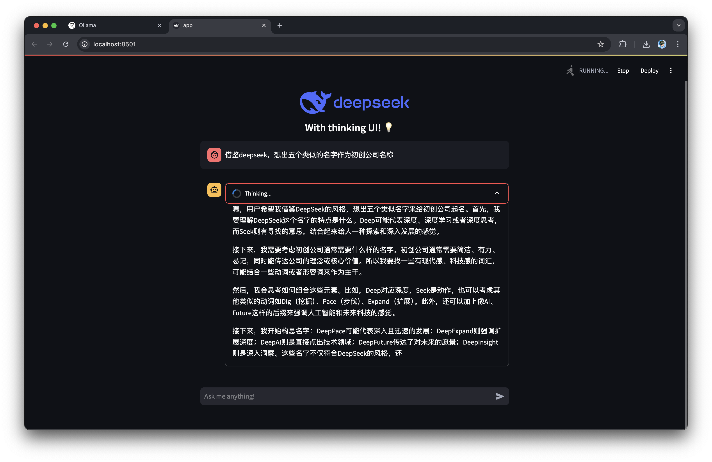
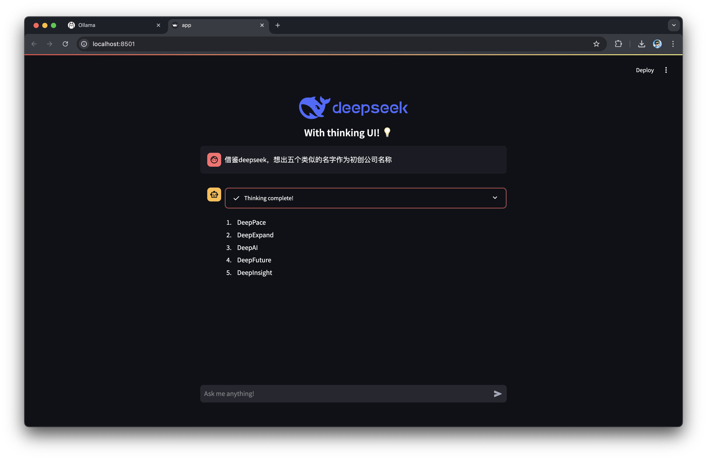

# DeepSeek Thinking UI 🤔💡

A streamlined chat interface powered by Ollama and DeepSeek, featuring an innovative "thinking UI" that provides transparency into the AI's reasoning process.

## Features ✨

- 🧠 Real-time "thinking" visualization
- 💬 Interactive chat interface
- 🔄 Streaming responses
- 💭 Expandable thinking process
- 🎯 Clean and intuitive UI

## Demo 📸

### Thinking Phase


### Response Phase


## Requirements 📋

- Python 3.7+
- Streamlit
- Ollama
- DeepSeek model

## Installation 🛠️

1. Clone the repository:
```bash
git clone https://github.com/yourusername/deepseek-thinking-ui.git
cd deepseek-thinking-ui
```

2. Install dependencies:
```bash
python -m venv .venv
source .venv/bin/activate
pip install streamlit ollama
```

3. Make sure you have Ollama installed and the DeepSeek model pulled:
```bash
ollama pull deepseek-r1
```

## Usage 🚀

1. Start the Streamlit app:
```bash
streamlit run app.py
```

2. Open your browser and navigate to `http://localhost:8501`

3. Start chatting with the AI! You'll see its thinking process in real-time.

Feel free to modify the code to suit your needs. Enjoy!